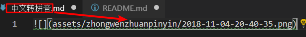

# Paste Image

Paste image directly from clipboard to markdown/asciidoc(or other file)!

## 默认情况



## 编译方式

```
gie clone https://github.com/285571052/vscode-paste-image.git
cd ./vscode-paste-image
npm install
npm install -g vsce
vsce package
```

## 下载地址

[vscode-paste-image-0.9.5.vsix](https://github.com/285571052/vscode-paste-image/releases/download/release/vscode-paste-image-0.9.5.vsix)

## Usage

1. capture screen to clipboard
2. Open the command palette: `Ctrl+Shift+P` (`Cmd+Shift+P` on Mac)
3. Type: "Paste Image" or you can use default keyboard binding: `Ctrl+Shift+V` (`Cmd+Shift+V` on Mac).
4. Image will be saved in the folder that contains current editing file
5. The relative path will be paste to current editing file 

## Config

- `pasteImage.path`

    The destination to save image file.
    
    You can use variable `${currentFileDir}`, `${projectRoot}`, `${currentFileName}` and `${currentFileNameWithoutExt}`. 
    
    - `${currentFileDir}` will be replace by the path of directory that contain current editing file. 
    - `${projectRoot}` will be replace by path of the project opened in vscode.
    - `${currentFileName}` will be replace by current file name with ext.
    - `${currentFileNameWithoutExt}` will be replace by current file name without ext.

    Default value is `${currentFileDir}`.

- `pasteImage.basePath`

    The base path of image url.
    
    You can use variable `${currentFileDir}`, `${projectRoot}`, `${currentFileName}` and `${currentFileNameWithoutExt}`. 
    
    - `${currentFileDir}` will be replace by the path of directory that contain current editing file. 
    - `${projectRoot}` will be replace by path of the project opened in vscode.
    - `${currentFileName}` will be replace by current file name with ext.
    - `${currentFileNameWithoutExt}` will be replace by current file name without ext.

    Default value is `${currentFileDir}`.

- `pasteImage.forceUnixStyleSeparator`

    Force set the file separator styel to unix style. If set false, separator styel will follow the system style. 
    
    Default is `true`.

- `pasteImage.prefix`

    The string prepend to the resolved image path before paste.

    Default is `""`.

- `pasteImage.suffix`

    The string append to the resolved image path before paste.

    Default is `""`.

## Config Example

I use vscode to edit my hexo blog. The folder struct like this:

```
blog/source/_posts  (articles)
blog/source/img     (images)
```

I want to save all image in `blog/source/img`, and insert image url to article. And hexo will generate `blog/source/` as the website root, so the image url shoud be like `/img/xxx.png`. So I can config pasteImage in `blog/.vscode/setting.json` like this:

```
"pasteImage.path": "${projectRoot}/source/img",
"pasteImage.basePath": "${projectRoot}/source",
"pasteImage.forceUnixStyleSeparator": true,
"pasteImage.prefix": "/"
```

## Format

### File name format

If you selected some text in editor, then extension will use it as the image file name. **The selected text can be a sub path like `subFolder/subFolder2/nameYouWant`.**

If not the image will be saved in this format: "Y-MM-DD-HH-mm-ss.png". 

### File link format

When you editing a markdown, it will pasted as markdown image link format ``.

When you editing a asciidoc, it will pasted as asciidoc image link format `image::imagePath[]`.

In other file, it just paste the image's path.